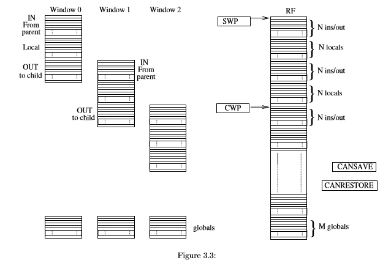

Now you should transform your simple RF in a structure that allows context switching when a subroutine is called. Use three generics:

    • M for the number of global registers
    • N for the number of registers in each of the IN or OUT or LOCAL window (fixed window) 
    • F for the number of windows

The structure is similar to the one in figure 3.3: on the right is the structure of the physical RF and on the left the part of the physical RF that are included in the active window. Four registers might be necessary to transform the virtual in the physical RF and to manage the moment in which the RF must SPILL/FILL to/from memory without the need of excessive HW. These registers are SWP, CWP, CANSAVE, CANRESTORE and are used only internally. FourfurthersignalsatleastarenecessaryasI/OofyouRF:CALLandRETURNforsubroutinemanagement, and FILL and SPILL when data are to be moved from and to the memory respectively. This also means that a BUS to/from memory is needed as a signal in your entity.

The expected behavior is in the following. 

Within a SUB For each subroutine the external blocks see only the active window. The whole active window is composed of the ensemble of the global registers, of one IN, one LOCAL and one OUT block of N registers.
The fact that data will be written in a IN or LOCAL ... does not depend on the RF control: it only receives an address related to that active window and has to transform in an actual address to the physical register file. Notice that from the external point of view the RF is always a N*3+M wide register file. In order to transform the external address to the physical address you can use a few registers which save the values of pointers. The Current Window Pointer (CWP) holds the pointer to the IN block of the current window. During normal operations within a subroutine, the CWP is used to transform the external address to the physical address. SUB call Let’s now suppose that a subroutine is called. A signal CALL is risen, for example by the control unit or decode stage: you can suppose this is one input signal for your RF. When a new subroutine is called (CALL active) the CWP is shifted by 2×N positions so that OUT of current window becomes a IN of next window. This can be done provided that new windows are available in the physical register. This information (new windows are still available, if not see SPILL below) is stored in the CANSAVE register. You can decide how to use this register: the suggestion is that it helps you avoiding using complex HW (e.g. comparisons like CWP>3*N+M or similar are not exactly economic choices....)

SUB return When the current subroutine gives a RETURN, then the CWP is shifted back of 2×N positions, provided that the window correspondent to the parent subdirectory is present in the register file (otherwise see FILL below). This information (parent is in RF) is stored in the CANRESTORE register. SPILL In case no more registers are available then a SPILL in memory must be performed for the oldest INLOCAL blocks. This operation means that the RF rises the SPILL signal to an external block (e.g. the MMU) the reads the bus where the RF puts the data in the window to be spilled. Notice that this operation cannot be executed in one clock cycle: you must suppose to spill one register at each clock cycle. To do this you can use the CWP that must be correctly updated (remember that this is used as a circular buffer). At the end of this operation the SAVED WINDOW POINTER (SWP) should hold the pointer to the RF address (or block number) which is no more in the RF.

FILL In case you had previously one or more SPILL, followed by subsequent returns from subroutine, it happens sooner or later that the values spilled must be fed again in the RF from memory. This is detected when the CWP (that is being decremented as during a return phase) equalizes the SWP: this means that a further decrement of CWP must be preceded by a FILL. For this the RF rises the SPILL command. Here you are free of deciding what happens: either assume that the MMU always sends immediately the sequence of data, or that after a while the MMU reacts and gives the data and an ack-signal (that you should add to the I/O list). Once the fill is concluded also the CWP and the SWP should be updated. 

Jour job is to describe this organization, considering only the operations strictly related to the RF and its local control. For example in case a SUB or a RETURN instruction are to be executed, from the RF point of view not the whole instruction execution is important but only the correspondent control signals from the control unit which manages the RF operations. Such control signals will activate a few management actions local to the RF that you should provide. Write a testbench starting from the previously used ones to show the correct behavior in case a SUB or a RETURN instruction. You should also take into account SPILL and FILL occurrences, but writing and reading to/from memory is not your concern: just define a way to give to RF output or receive from RF input a sequence of registers. Finally, you are not writing any controller here: just suppose to have as input or give as output a few control signals you may need.
